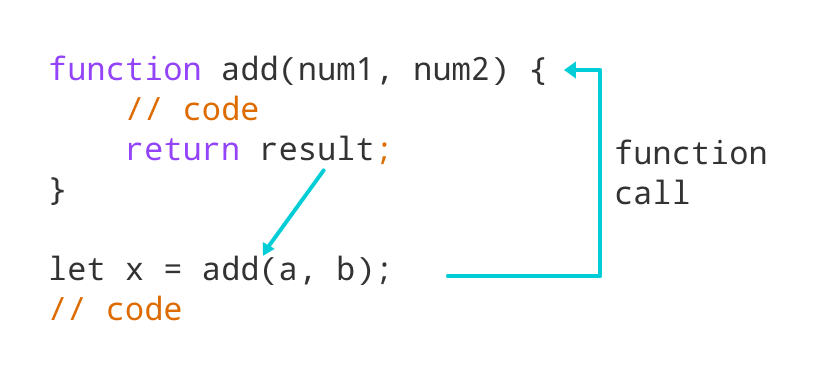

# Summary Reading of HTML from

*Chapter 4: Ch.4 “Links” (pp.74-93)*
*Chapter 15: “Layout” (pp.358-404)*
*Chapter 3 (first part): “Functions, Methods, and Objects” (pp.86-99 ONLY)*

## Links

**What is it?**

links they allow you to move from one web page to another — enabling the very idea of browsing or surfing
there are many types of links :
    1. Links from one website to another
    2. Links from one page to another on the same website
    3. Links from one part of a web page to another part of the same page
    4. Links that open in a new browser window
    5. Links that start up your email program and address a new email to someone

**How to do this?**

Links are created using the `<a>` element. Users can click on anything between the opening `<a>` tag and the closing
`</a>` tag. You specify which page you want to link to using the href attribute.

There are two types of  URL ( Uniform Resource Locator) :

1. relative URL : can be used when linking to pages within your own website.
2. an absolute URL.

**Email Links**
To create a link that starts up the user's email program and addresses an email to a specified
email address, you use the `<a>` element. However, this time the value of the href attribute starts
with mailto: and is followed by the email address you want the email to be sent to.

## Layouts

1. Fixed Width Layout : designs do not change size as the user increases or decreases the size of their browser window.
Measurements tend to be given in pixels.
2. Liquid layout : designs stretch and contract as the user increases or decreases the size of their browser window. They tend to use percentages.
3. Grid Layout

Notes

- `
` elements are often used as containing elements to group together sections of a page.
- Browsers display pages in normal flow unless you specify relative, absolute, or fixed positioning.
- The float property moves content to the left or right of the page and can be used to create multi-column layouts. (Floated items require a defined width.)
- Pages can be fixed width or liquid (stretchy) layouts.
- Designers keep pages within 960-1000 pixels wide, and indicate what the site is about within the top 600 pixels (to     demonstrate its relevance without scrolling).
- Grids help create professional and flexible designs.
- CSS Frameworks provide rules for commo- You can include multiple CSS files in one page.

## Functions & Methods

complex scripts can run to hundreds (even thousands) of lines. Programmers use functions, methods, and objects to organize their code.

WHAT IS A FUNCTION?

Functions let you group a series of statements together to perform a specific task. If different parts of a script repeat the same task, you can reuse the function (rather than repeating the same set of st atements).

HOW TO DECLARE IT?

HOW TO INVOKE IT?

