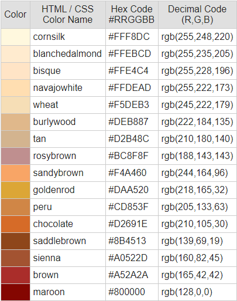
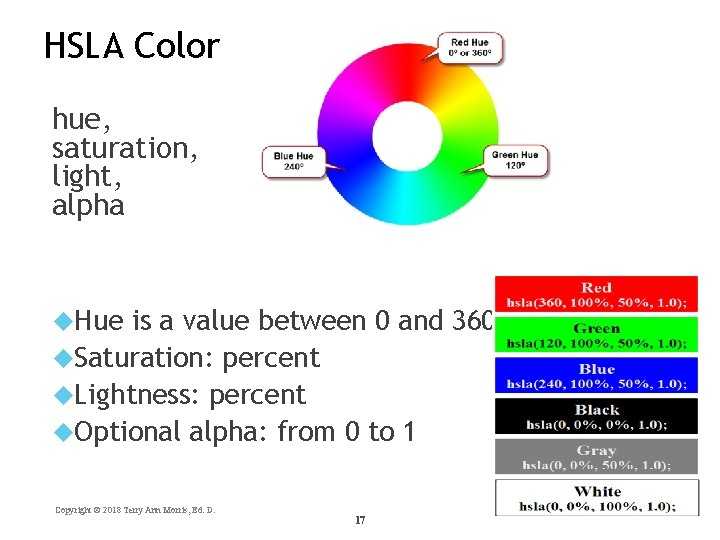
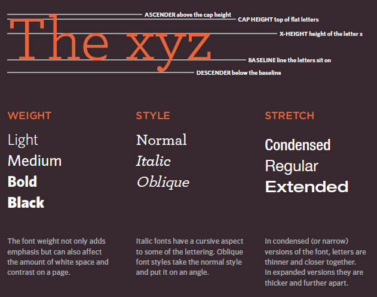

# Reading Notes of class 05

## Outlines

*Chapter 5: “Images” (pp.94-125)*
*Chapter 11: “Color” (pp.246-263)*
*Chapter 12: “Text” (pp.264-299)*

### Images

To add an image into the page you need to use an `` element. This is an empty element (which means there is
no closing tag). It must carry the following two attributes:

1. `src` This tells the browser where it can find the image file. This will usually be a relative URL
pointing to an image on your own site.

2. `alt` This provides a text description of the image which describes the image if you cannot see it.

*if you want to specify its size by using `height` and `width` these specify the height and width of the image in pixels*
  
   img
   {
      height: 200px;
      width: 200px;
    }

**Positioning Images**
We can use a number of different approaches to position images on a web page. By default images are positioned as inline-level elements; however, their positions may be changed using CSS, specifically the float, display, and box model properties, including padding, border, and margin.

**Inline Positioning Images**
The `` element is by default an inline-level element. Adding an image without any styles to a page will position that image within the same line as the content that surrounds it. Additionally, the height of the line in which an image appears will be changed to match the height of the image, which can create large vertical gaps within that line.

**Block Positioning Images**
Adding the display property to an image and setting its value to block forces the image to be a block-level element. This makes the image appear on its own line, allowing the surrounding content to be positioned above and below the image.

     img
      {
        display: block;
       }

**Positioning Images Flush Left or Right**
Sometimes displaying an image as inline or block, or perhaps even inline-block, isn’t ideal. We may want the image to appear on the left or right side of its containing element, while all of the other content wraps around the image as necessary. To do this, we use the float property with a value of either left or right.

    img {
  background: #eaeaed;
  border: 1px solid #9799a7;
  float: right;
  margin: 8px 0 0 20px;
  padding: 4px;
     }
Note : create a folder for all of the images the site uses.

### Color

The color property allows you to specify the color of text inside an element. You can specify any
color in CSS in one of three ways:

**1. rgb values**  
These express colors in terms of how much red, green and blue are used to make it up.
 *For example: rgb(100,100,90)*

**2. hex codes**
These are six-digit codes that represent the amount of red, green and blue in a color, preceded by a pound or hash #
sign.
*For example: #ee3e80*

**3. color names**
There are 147 predefined color names that are recognized by browsers.
*For example: DarkCyan*

**4. HSLA**

### Text

font type face:

The font-family property allows you to specify the typeface that should be used for any text inside the element(s) to
which a CSS rule applies. The value of this property is the name of the typeface you want to use.

font size :
The font-size property enables you to specify a size for the font. There are several ways to specify the size of a font. The most common are:

1. pixels : Pixels are commonly used because they allow web designers very precise control over how much space their text
takes up. The number of pixels is followed by the letters px.

2. percentages : The default size of text in browsers is 16px. So a size of 75% would be the equivalent of 12px, and 200% would be 32px.

3. ems : An em is equivalent to the width of a letter m.

   body {
     font-family: Arial, Verdana, sans-serif;
     font-size: 12px;}
      h1 {
      font-size: 200%;}
      h2 {
      font-size: 1.3em;}

The text-transform property :
is used to change the case of text giving it one of the following values

1. uppercase
2. lowercase
3. capitalize

the font-style :

is used to create italic text,  There are three values this property can take:

1. normal
2. italic
3. oblique .
