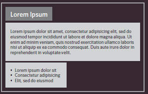
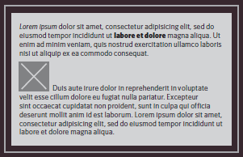

# CSS layout

CSS treats each HTML element as if it is in its own box. This box will either be a block-level box or an inline box.

1. Block level box

Block-level elements start on a new line
Examples include:
        `<h1> 
 <ul> <li>`

2. Inline box
 

Inline elements flow in between surrounding text
Examples include:
         ` <b> <i>`

Containing Elements
If one block-level element sits inside another block-level element then the outer box is known as the containing or parent element.

Layouts types :

1. Fixed Width Layouts : designs do not change size as the user increases or decreases the size of their browser window. Measurements tend to be given in pixels.

2. Liquid Layouts : stretch and contract as the user increases or decreases the size of their browser window. They tend to
use percentages.

3. A Fixed Width Layout : the width of the main boxes on a page will usually be specified in pixels

4. Layout Grids

## Layout Grids : The 960 pixel grid

you can see a set of thick vertical lines superimposed over the top of a newspaper website to show you how the
page was designed according to a grid.

WHY ?

1. Creates a continuity between different pages which may use different designs
2. Helps users predict where to find information on various pages
3. Makes it easier to add new content to the site in a consistent way
4. Helps people collaborate on the design of a site in a consistent way

### CSS frameworks

CSS frameworks aim to make your life easier by providing the code for common tasks, such as creating layout grids, styling forms, creating printer-friendly versions of pages and so on. You can include the CSS framework code in your projects rather than writing the CSS from scratch.

Here is the top CSS frameworks list:

Bootstrap
Foundation
Materialize
Semantic UI
Bulma
Tailwind
