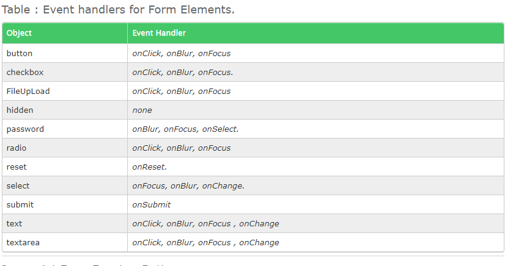

# HTML FORMS AND JAVASCRIPT EVENTS

## Forms

The form property within the document object contains an array of all forms defined within the document.

Each element within the array is a form object , the index number associated with the form object defines the order in which the form appears on the webpage.

The exits a number of events associated with the form element. The table below enumerates them in detail.

### Events

Javascript Form Events : Buttons
The main utility of a button object is to trigger an event, say an onClick() event, but a button object has no default action.

The are several types of buttons associated with a form:

submit
reset
button

Using the event handler onClick is the most frequently used in form, or elsewhere to trigger event handler function on click events.

A click event is set to take place when the button within a form, radio or checkbox is pressed or when a selection is made.

The event handler onFocus is fired when a form element gets the focus.

Similarly, the onblur event handler is fired when the form element loses focus, i.e when the cursor moves away from form field
