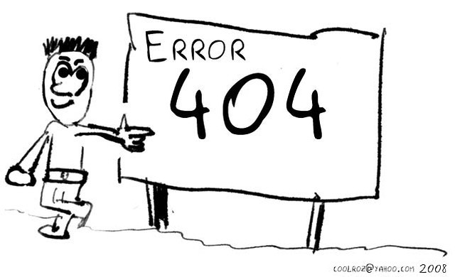
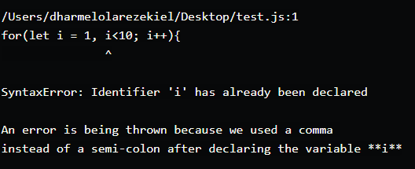

# JavaScript Debugging and Error Handling

There are two types of errors in JavaScript:

1. The first is a programming error, where we, the JavaScript developers, do something wrong. These types of errors are typically found using our favorite browser and our favorite debugger.

2. The second type of error occurs when the web page reader answers a question incorrectly, pushes the wrong button, or tries to type in a Social Security number when we’re expecting a name. Or the error can happen when we’re mixing libraries and something goes wrong between them.

Types of Errors in Javascript
There are seven types of built-in errors in javascript, but we will be looking at the three common types in this article. You can check out javascript documentation for more insights.

1. SyntaxError:This error occurs when the syntax of a particular language is not met. This error is usually thrown when there are typos, mismatched brackets or curly braces, or missing semi-colons in our code.

               

2. ReferenceError : This type of error occurs when you're trying to reference an invalid value. e.g calling a variable that was not defined. In some cases, the variable could be defined and you'll still get a reference error and this is usually the effect of scoping because when you declare a variable with let/const, such variable can not be accessed outside the function where it is declared.
                   

3. TypeError:This error is thrown when the value passed to an expression is not the expected type. e.g using a string method on a number.
                 

## The Debugger

In order to debug errors in javascript, there are few things you should do first. Luckily, the console always comes to the rescue here.

In what line did the error occur: This is usually the first thing to look out for when trying to debug. The console always points out the particular line where the error is.
What type of error was thrown: After finding out the line where the error occurred, the next thing to do is check what type of error was logged to the console.

the different ways of handling errors and these are:

1. try... catch statement
2. Throw statement
