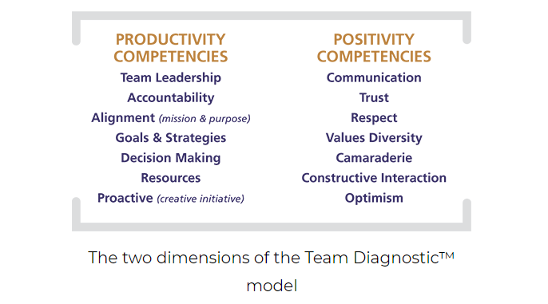

# What Google Learned About Teams

Thousands of teams, worldwide have experienced the assessment and the coaching process that helps teams identify and practice new behavior—effectively creating new norms and in a process that naturally builds sustainable psychological safety.

Creating and integrating new practices, new norms is an investment of time and attention that pays off. Change does not happen by decree; it happens by degree. It is also cumulative.

How to Build a Strong Team:

1. Establish expectations from day one.
2. Respect your team members as individuals. At work, you want your employees to be part of a team, but you must also have perspective: these are individuals with stories of their own.
3. Engender connections within the team. While it’s critically important that you value and honor each individual member of the team, it’s also important that the team members themselves exhibit that same respect and care toward one another.
4. Encourage individuals to not regard one another as a body who sits at the desk next to them, but as a business partner who will work toward a shared goal of business development, individual success, and achieving team goals.
5. Practice emotional intelligence.
6. Motivate with positivity. Great leaders also subscribe to the theory that “you get more flies with honey than vinegar.” In real world terms, this means that it’s more effective to shape behavior with positive reinforcement rather than negative reinforcement.
7. effective communication can keep working relationships strong for decades, while silence can break things apart very quickly.
8. Diversify. When it comes to building your business, your team should be as diverse as possible—different backgrounds, experiences, ages, and opinions.
9. Find a team you trust. Find a self-starter: someone who can make decisions on your behalf and who’s going to be a good ambassador for you and your business.
10. Groom them to be collaborators by empowering them to make leadership decisions on their own. You’re investing time and resources into this person, so consider their potential for longevity at your company or within your industry.
