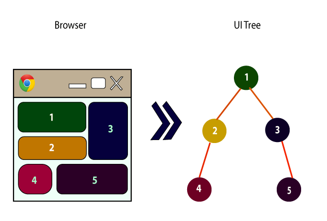
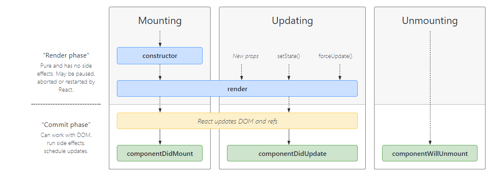

# what is React ?

ReactJS is a declarative, efficient, and flexible JavaScript library for building reusable UI components. It is an open-source, component-based front end library responsible only for the view layer of the application. It was created by Jordan Walke, who was a software engineer at Facebook. It was initially developed and maintained by Facebook and was later used in its products like WhatsApp & Instagram. Facebook developed ReactJS in 2011 in its newsfeed section, but it was released to the public in the month of May 2013.

## what is a component?

A Component is considered as the core building blocks of a React application. It makes the task of building UIs much easier. Each component exists in the same space, but they work independently from one another and merge all in a parent component, which will be the final UI of your application.

Every React component have their own structure, methods as well as APIs. They can be reusable as per your need. For better understanding, consider the entire UI as a tree. Here, the root is the starting component, and each of the other pieces becomes branches, which are further divided into sub-branches.

Components let you split the UI into independent, reusable pieces, and think about each piece in isolation. This page provides an introduction to the idea of components. You can find [a detailed component API reference here.](https://reactjs.org/docs/react-component.html)

## component characteristics

1. Reusability: can be reused in different situations.
2. Replaceable: components can be easily removed or replaced.
3. Not context specific: works in different environments or contexts.
4. Extensible: components can be extended to change the behaviour.
5. Encapsulated: do not expose details of the internal processes or any internal variables or state.
6. Independent: components have minimal dependence on other components.

### advantages of using component based architecture

1. Ease of deployment: easier to replace existing versions with no impact on the other components.
2. Reduced cost: The use of third-party components allows you to spread the cost of development and maintenance.
3. Ease of development.
4. Reusable: the use of reusable components means that they can be used to spread the development and maintenance cost across several applications or systems.
5. Modification of technical complexity: A component modifies the complexity through the use of a component container and its services.
6. Reliability: The reliability of each individual component enhances the reliability of the whole system via reuse.
7. System maintenance and evolution: Easy to change and update the implementation without affecting the rest of the system.
8. Independent: Independency and flexible connectivity of components.

### component lifecycle

### what is props?

“Props” is a special keyword in React, which stands for properties and is being used for passing data from one component to another, props data is read-only, which means that data coming from the parent should not be changed by child components.

“Props” is a special keyword in React, which stands for properties and is being used for passing data from one component to another.
But the important part here is that data with props are being passed in a uni-directional flow. (one way from parent to child)
Furthermore, props data is read-only, which means that data coming from the parent should not be changed by child components.

To know how to use Props see [this example](https://itnext.io/what-is-props-and-how-to-use-it-in-react-da307f500da0#:~:text=%E2%80%9CProps%E2%80%9D%20is%20a%20special%20keyword%20in%20React%2C%20which,uni-directional%20flow.%20%28one%20way%20from%20parent%20to%20child%29)
