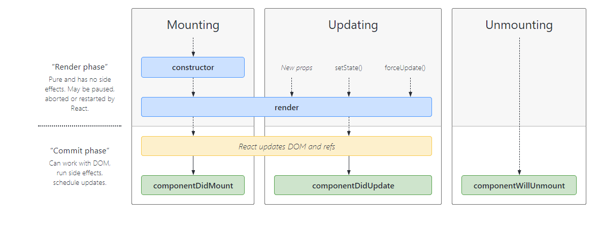

# React: Component Lifecycle Events

**What are component lifecycle events?**
React lets you define components as classes or functions. The methods that you are able to use on these are called lifecycle events. These methods can be called during the lifecycle of a component, and they allow you to update the UI and application states.

1. Mounting
These methods are called in the following order when an instance of a component is being created and inserted into the DOM:

        constructor()
        static getDerivedStateFromProps()
        render()
        componentDidMount()

2. Updating
An update can be caused by changes to props or state. These methods are called in the following order when a component is being re-rendered:

         static getDerivedStateFromProps()
         shouldComponentUpdate()
         render()
         getSnapshotBeforeUpdate()
         componentDidUpdate()

3. Unmounting
This method is called when a component is being removed from the DOM:

           componentWillUnmount()
4. Error Handling
These methods are called when there is an error during rendering, in a lifecycle method, or in the constructor of any child component.

        static getDerivedStateFromError()
        componentDidCatch()
