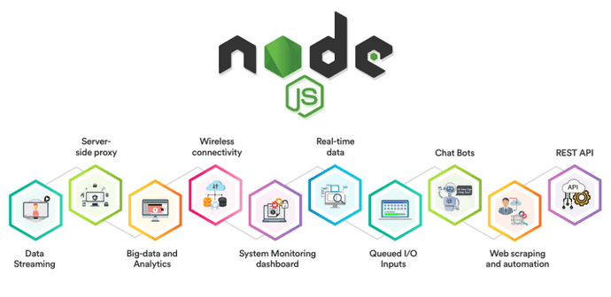

# What is node.js?

 Node.js is a JavaScript runtime built on Chrome’s V8 JavaScript engine. Node.js is not a programming language. Rather, it’s a runtime environment that’s used to run JavaScript outside the browser.

Neither is Node.js a framework (a platform for developing software applications). The Node.js runtime is built on top of a programming language—in this case, JavaScript—and helps in running frameworks itself.

 Here is the use cases of node.js:
 

**Features Of Node.js**
Node.js has grown quickly in the last few years. This is thanks to the vast list of features it provides:

1. Easy—Node.js is quite easy to start with. It’s a go-to choice for web development beginners. With a lot of tutorials and a large community—getting started is very easy.
2. Scalable—It provides vast scalability for applications. Node.js, being single-threaded, is capable of handling a huge number of simultaneous connections with high throughput.
3. Speed—Non-blocking thread execution makes Node.js even faster and more efficient.
4. Packages—A vast set of open-source Node.js packages is available that can simplify your work. There are more than one million packages in the NPM ecosystem today.
5. Strong backend—Node.js is written in C and C++, which makes it speedy and adds features like networking support.
6. Multi-platform—Cross-platform support allows you to create SaaS websites, desktop apps, and even mobile apps, all using Node.js.
7. Maintainable—Node.js is an easy choice for developers since both the frontend and backend can be managed with JavaScript as a single language.

 Not surprisingly, it’s a popular selection with millions of companies, too. Here are a few popular ones that use Node.js today:

* Twitter
* Spotify
* eBay
* Reddit
* LinkedIn
* Godaddy
* PayPal

How To Install Node.js??

   curl "<https://nodejs.org/dist/latest/node>-${VERSION:-$(wget -qO- <https://nodejs.org/dist/latest/> | sed -nE 's|.*>node-(.*)\.pkg.*|\1|p')}.pkg" > "$HOME/Downloads/node-latest.pkg" && sudo installer -store -pkg "$HOME/Downloads/node-latest.pkg" -target "/"

Check The Version Of Node.js Installed
In the previous section, we successfully installed Node. Let’s verify it by checking the installed version. Run the following command in the terminal.

node -v

## what is Chrome’s V8 JavaScript Engine?

V8 is an open-source JavaScript engine developed by the Chromium Project for Google Chrome and Chromium web browsers. The project’s creator is Lars Bak. The first version of the V8 engine was released at the same time as the first version of Chrome: 2 September 2008. It has also been used on the server side, for example in Couchbase and Node.js.

**What Can Node.js Do?**

Node.js can generate dynamic page content
Node.js can create, open, read, write, delete, and close files on the server
Node.js can collect form data
Node.js can add, delete, modify data in your database

A common task for a web server can be to open a file on the server and return the content to the client.

Here is how PHP or ASP handles a file request:

Sends the task to the computer's file system.
Waits while the file system opens and reads the file.
Returns the content to the client.
Ready to handle the next request.
Here is how Node.js handles a file request:

Sends the task to the computer's file system.
Ready to handle the next request.
When the file system has opened and read the file, the server returns the content to the client.
Node.js eliminates the waiting, and simply continues with the next request.

Node.js runs single-threaded, non-blocking, asynchronously programming, which is very memory efficient.

## What is npm?

NPM is a package manager for Node.js packages, or modules if you like.
www.npmjs.com hosts thousands of free packages to download and use.
The NPM program is installed on your computer when you install Node.js

## What version of node are you running on your machine? node version : v14.17.3

## What version of npm are you running on your machine? node package manager version : 6.14.13

## What command would you type to install a library/package called ‘jshint’?

JSHint is available for multiple platforms. The online web tool that most of us are familiar with is at jshint.com. There are also the command line tool via Node.js, a JavaScript API, multiple text editors, and IDE plugins for JSHint.

Step 1:
If you haven’t have Node.js installed in your computer, then you’ll have to go its website and download and install it first. To check if Node.js has been successfully installed you can run the command npm -version

Step 2 :
To install the JSHint tool, run the command npm install jshint in CLI. If you want to check if JSHint has been successfully installed, run the command jshint -version to see its version.

Step 3 :
To run the tool, go to the directory in the CLI where your JavaScript file (say test.js) is and run the command jshint test.js.
