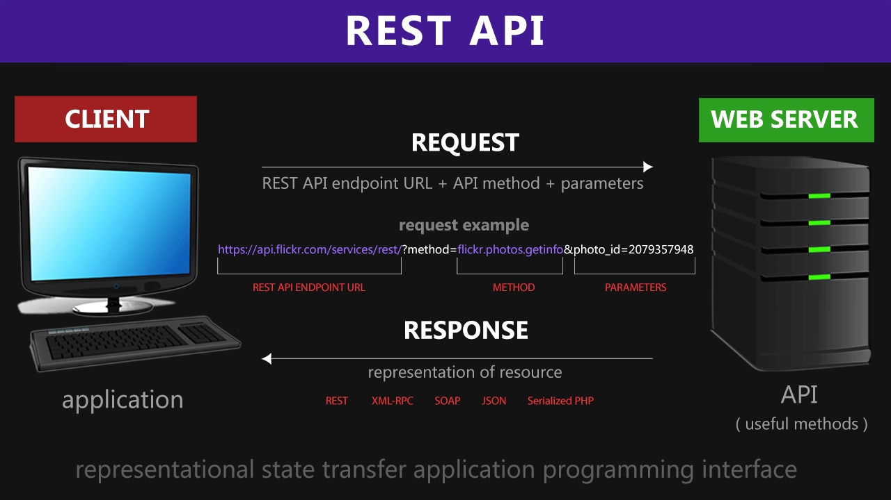

# REST

RESTful CRUD (Create, Retrieve, Update, Delete) API with Node.js, Express and MongoDB. We’ll use Mongoose for interacting with the MongoDB instance.

Express is one of the most popular web frameworks for node.js. It is built on top of node.js http module, and adds support for routing, middleware, view system etc. It is very simple and minimal, unlike other frameworks that try do way to much, thereby reducing the flexibility for developers to have their own design choices.

Mongoose is an ODM (Object Document Mapping) tool for Node.js and MongoDB. It helps you convert the objects in your code to documents in the database and vice versa.

Who is Roy Fielding?

Roy Thomas Fielding (born 1965) is an American computer scientist, one of the principal authors of the HTTP specification and the originator of the Representational State Transfer (REST) architectural style. He is an authority on computer network architecture and co-founded the Apache HTTP Server project

Before HTTP, or Hypertext Transfer Protocol, computer users would type the word “get” and a Web address when they wanted information. Fielding belonged to a small Web community that revised the standard into an email-like format, allowing users to send and receive hypertext documents. By clicking on hyperlinks, they could browse through Web pages containing graphics, sounds, video and other multimedia. Suddenly, everyone was surfing the Net.

“I did not invent the Internet — which some people joke about — and I didn’t invent HTTP,” Fielding says. “But I did create many aspects of what we now call HTTP. I wrote most of the text that defines it, and I was the primary architect of the current version, HTTP/1.1.”

HTTP Methods
GET
POST
PUT
HEAD
DELETE
PATCH
OPTIONS
The two most common HTTP methods are: GET and POST.

The GET Method
GET is used to request data from a specified resource.

GET is one of the most common HTTP methods.

Note that the query string (name/value pairs) is sent in the URL of a GET request:

/test/demo_form.php?name1=value1&name2=value2
Some other notes on GET requests:

GET requests can be cached
GET requests remain in the browser history
GET requests can be bookmarked
GET requests should never be used when dealing with sensitive data
GET requests have length restrictions
GET requests are only used to request data (not modify)
The POST Method
POST is used to send data to a server to create/update a resource.

The data sent to the server with POST is stored in the request body of the HTTP request:

POST /test/demo_form.php HTTP/1.1
Host: w3schools.com
name1=value1&name2=value2
POST is one of the most common HTTP methods.

Some other notes on POST requests:

POST requests are never cached
POST requests do not remain in the browser history
POST requests cannot be bookmarked
POST requests have no restrictions on data length

## API Keys

1. Geocoding API
2. Weather Bit API
3. Yelp API Docs
4. The Movie DB API

* Developing REST API using Nodejs + MongoDB
Prerequisites You should have the following installed in your system.

1. Nodejs
2. NPM
3. MongoDB
